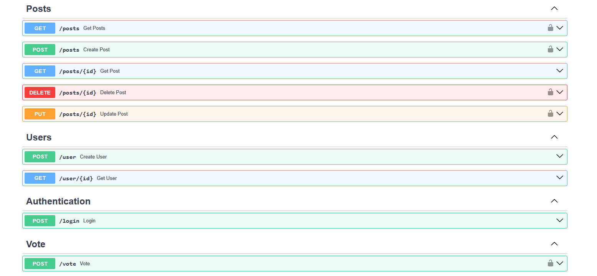

# Diseño de una API REST con Python y FastAPI

Este proyecto consiste en el desarrollo de una **API REST** de alto rendimiento utilizando **Python** y el framework **FastAPI**. 

### 📱 Funcionalidades de Red Social
Los endpoints han sido diseñados para replicar las interacciones fundamentales de una red social moderna:

* **Posts:** Creación de publicaciones y su visualización.
* **Usuarios:** Creación de usuarios y su visualización.
* **Votos:** Gestión de "likes" de cada post.
* **Login:** El endpoint de **login** garantiza la integridad del sistema mediante:
	* **OAuth2:** Estándar de la industria utilizado para el flujo de autorización.
	* **JSON Web Tokens (JWT):** Implementados para gestionar la autenticación de forma segura, permitiendo que el servidor sea *stateless* y escalable.
